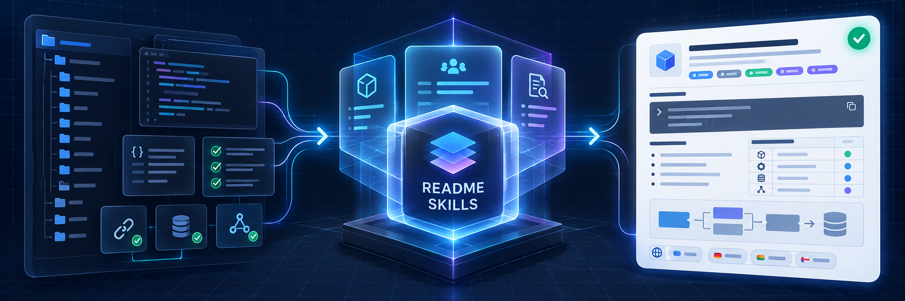
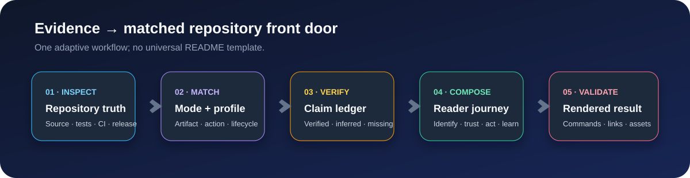
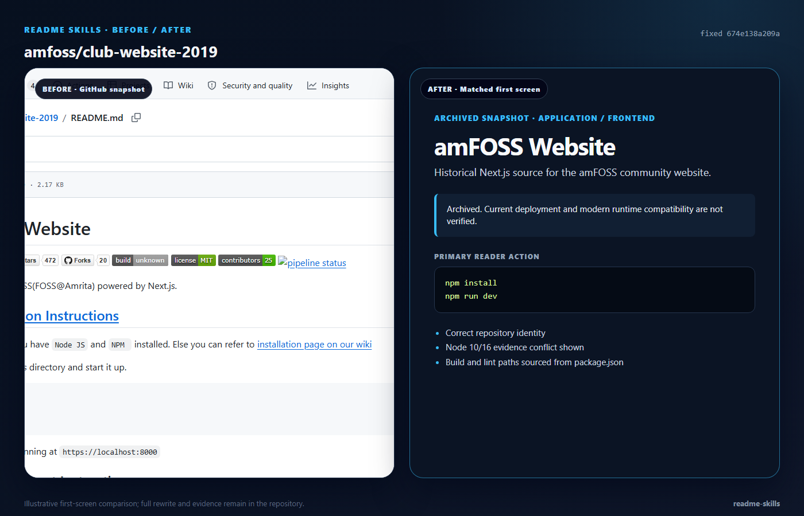
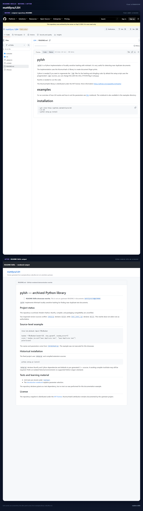
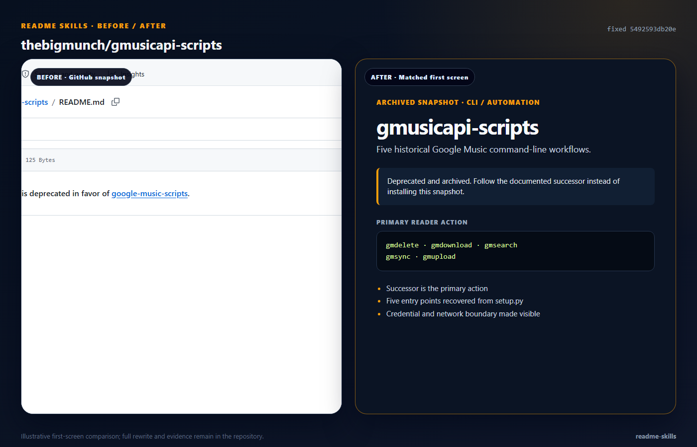
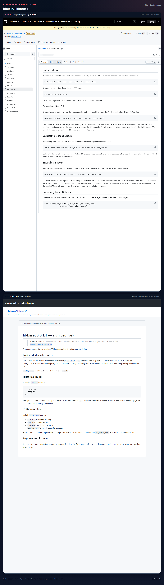
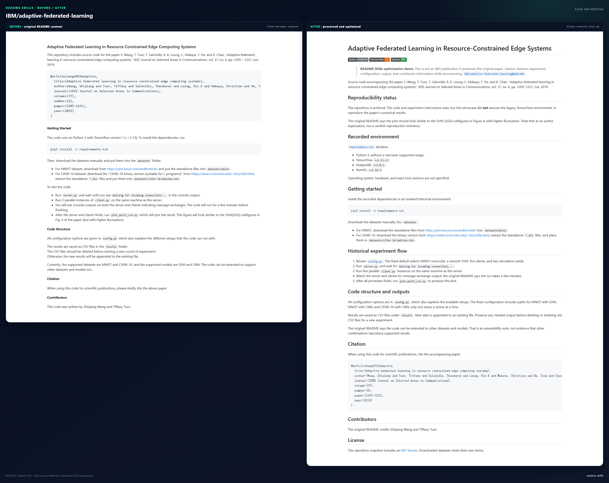
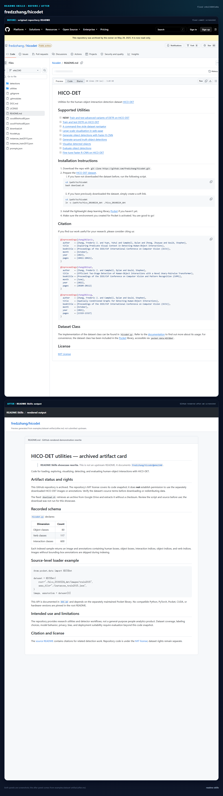
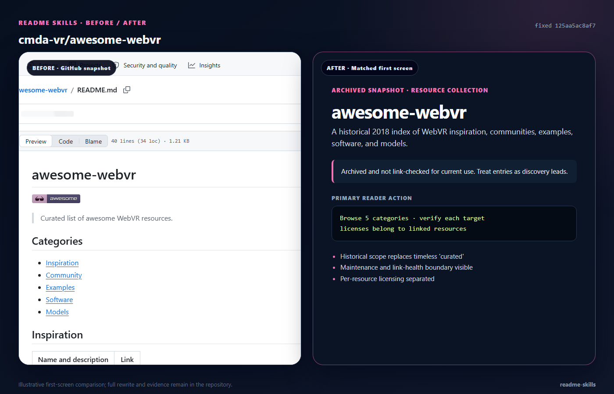
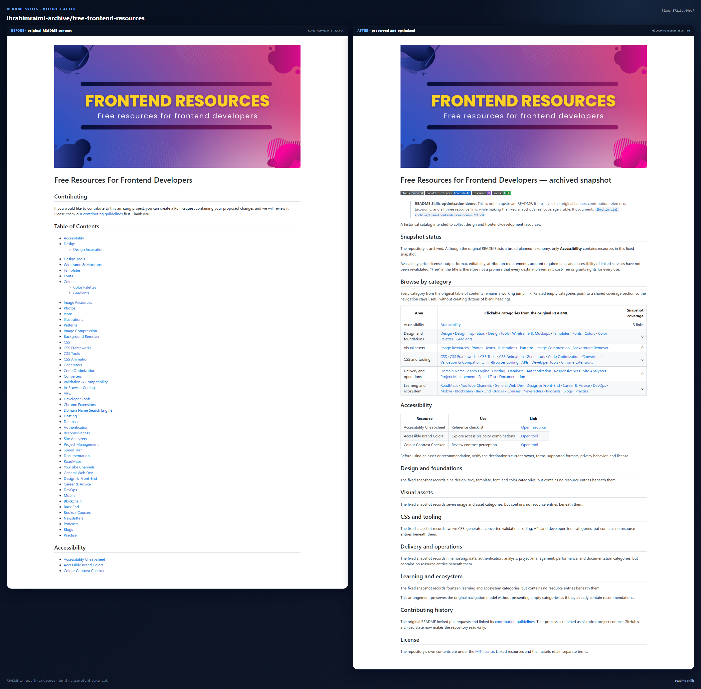

<div align="center">

# README Skills

**先匹配仓库，再写 README 的证据优先跨 Agent Skill。**

[](README.md) [](README.zh-CN.md)

[快速开始](#快速开始) · [兼容性](COMPATIBILITY.md) · [案例](#前后对比案例) · [研究报告](research/top-100-readme-study-2026-09-11.md) · [Skill 入口](SKILL.md)

[](COMPATIBILITY.md) [](VERSION) [](LICENSE) [](research/top-100-readme-study-2026-09-11.md) [](examples/README.md)

</div>



README Skills 会先检查真实项目，识别读者最需要完成的第一步，再创建或优化仓库首页。它不会用同一份通用模板套所有项目，而是根据产物类型、访问目的和生命周期选择结构。

> **当前版本：** `v0.4.0`。Skill 采用 MIT 许可证，并已作为完整仓库包通过本地校验。

## 为什么需要它

README 看起来专业，并不代表内容可靠。安装命令会过时，Roadmap 会被误写成已支持功能，脚手架会继承示例品牌，视觉包装也可能遮住真正的首次成功路径。

README Skills 会在写作前完成三个判断：

1. **工作模式：** 审查、生成、优化、重构或发版同步。
2. **仓库画像：** 它是什么、访问者来做什么、当前处于什么生命周期。
3. **证据边界：** 哪些声明已验证、可推断、缺失或互相冲突。

它最多只集中提问一次，而且仅限答案会显著改变项目身份、目标受众、法律含义或外部操作时。



## 快速开始

README Skills 遵循开放的 Agent Skills 目录格式。请保持仓库结构完整，并把它放到对应 Agent 能识别的 Skill 目录：

```bash
# 共享 Agent Skills 目录：Codex、Copilot、Gemini CLI、Cursor 和 OpenCode
git clone https://github.com/Shiaoming123/readme-skills.git "$HOME/.agents/skills/readme-skills"

# Claude Code
git clone https://github.com/Shiaoming123/readme-skills.git "$HOME/.claude/skills/readme-skills"
```

| Agent | 推荐目录 | 显式调用 |
| --- | --- | --- |
| Codex | `$HOME/.agents/skills/readme-skills` | `$readme-skills` |
| Claude Code | `~/.claude/skills/readme-skills` | `/readme-skills` |
| Copilot、Gemini CLI、Cursor、OpenCode | `~/.agents/skills/readme-skills` | 自然语言请求 |

项目级目录和各客户端原生目录详见[兼容性说明](COMPATIBILITY.md)。所有 Agent 共用同一份标准包；`agents/openai.yaml` 只负责可选的 OpenAI/Codex 界面元数据。

显式调用：

```text
$readme-skills 检查当前仓库并创建最合适的专业 README，尽量减少提问。
```

也可以直接自然描述：

```text
优化现有 README，保留有效品牌内容，不要虚构尚未支持的功能。
```

安装后请新建 Agent 会话或刷新 Skill 清单。Skill 描述支持隐式匹配，因此常规仓库 README 工作也能自动触发。

## 五种工作模式

| 模式 | 自动选择条件 | 默认行为 |
| --- | --- | --- |
| `audit-only` | 用户只要求审查或分析 | 不修改文件，只输出基于证据的问题 |
| `generate` | 根目录不存在可用 README | 审查仓库后生成最小完整文档 |
| `optimize` | 内容基本准确，但清晰度、导航或表现不足 | 保留有效内容和跳转目标，再进行聚焦优化 |
| `restructure` | 内容陈旧、矛盾或以实现细节为中心 | 保留有效材料，重建读者路径 |
| `release-sync` | 发版改变了版本、支持范围、迁移、截图或可用性 | 只同步受本次发版影响的内容 |

## 仓库类型自动匹配

README Skills 会选择一个主画像，再按证据增加必要叠加项。

| 仓库类型 | README 的适配重点 |
| --- | --- |
| 应用 / 前端 | 用户结果、真实产品证明、本地运行、交付平台、隐私与无障碍边界 |
| Library / SDK / API | 安装、最小集成示例、兼容性、稳定性和权威 API 文档 |
| CLI / 脚手架 / 自动化 | 首条成功命令、预期输出、生成结构、配置和副作用 |
| 服务 / 自托管 / 基础设施 | 架构、环境要求、部署、运维、升级、备份和安全边界 |
| Fork / mirror / downstream | 上游身份、分化原因、当前差异、兼容、同步与支持入口 |
| 研究 / 模型 / 数据集 | 贡献、复现、来源、评测、限制、引用和使用权限 |
| Skills / 资源 / 设计集合 | 范围、分类、收录规则、安装或格式、信任、署名和维护 |
| Monorepo / 文档 / 硬件 / 归档 | 包地图、阅读路径、物理约束，或醒目的生命周期与迁移状态 |

技术栈只影响命令和前置要求，不会代替项目身份。Skill 会从 manifest、锁文件、源码、测试和 CI 中提取技术事实。

## 先有证据，再写文案

Skill 大致按以下优先级检查信息：

1. 已验证的实际行为；
2. 可执行源码和公开入口；
3. manifest、锁文件与发布配置；
4. 测试、示例、CI 与部署文件；
5. 持续维护的权威文档；
6. 现有 README 与宣传文案。

重要声明会被标记为 `verified`、`inferred`、`missing` 或 `conflicting`。没有对应证据时，不会把项目写成安全、生产可用、跨平台、已发布或官方维护。

如果 README 与代码、manifest、测试、CI 或发布产物冲突，Skill 会采用证据支持的最窄表述完成安全的文档工作，并在交付时列出冲突证据、README 的处理方式和最小项目侧修复建议。

所有现有本地化 README 会被视为一个文档集合。默认情况下，每次实质修改都同步全部已发现语言版本，包括没有被主 README 链接的本地化文件；只有用户明确缩小语言范围时才排除。同步要求身份、命令、版本、链接、支持、安全和法律含义一致，不要求逐句直译。

## 有表现力，但不制造装饰债务

默认使用可移植的 GitHub Flavored Markdown 和仓库内资产。只有确实能帮助读者判断或行动时，才使用受限 HTML、明暗主题 `<picture>`、表格、`<details>`、SVG 架构图、演示、徽章或动态趋势组件。

| 组件类型 | 默认策略 |
| --- | --- |
| 原生结构 | 对较长或密集的 README 评估标题、链接、表格、`<details>` 和紧凑目录导航 |
| 可验证 Badge | 优先已有工作流状态、发布/软件包版本、许可证、文档、兼容性和语言导航 |
| 证明性媒体 | 优先仓库内截图、演示、SVG 与明暗主题图片，并提供有效替代文本 |
| 架构图 | 只有关系用文字或小表格难以讲清时才加入 |
| 动态服务 | 只有指标能帮助项目判断且有稳定文字或静态回退时才按需启用 |
| Profile 装饰 | 项目 README 默认不加入访客数、关注者、连续贡献、奖杯、音乐、笑话或个人活动卡片 |

生成、优化、重构和发版同步 README 时会默认执行 Badge 检查。只有版本、工作流、软件包、许可证或文档目标能够验证时才加入对应 Badge；证据缺失不会被包装成装饰性的“通过”状态。已有多语言 README 也会默认评估是否适合使用语言导航 Badge，本页顶部就是对应示例。

原生组件和仓库自有资产始终优先。外部生成器与组件集合只用于发现能力，不作为项目事实来源；使用动态组件前会检查可用性、新鲜度、凭据、隐私和失败回退。详细选择规则来自 [Awesome README Tools 能力调研](research/awesome-readme-tools-capability-study-2026-09-12.md)。

## 前后对比案例

案例采用公开仓库的固定 README 快照，这些快照对相应仓库类型存在明显的信息缺口。我们只评价该版本 README 的信息完整度，不评价项目本身；每个案例都会保留来源 URL、提交 SHA、许可证证据和事实审计。

八组案例现在全部按 `optimize` 模式处理，而不是把原文替换成摘要卡。版本化的 `before.md` 保存固定来源，`after.md` 则保留有效正文和跳转目标，在此基础上重组层级并补充证据。两侧都通过 GitHub Markdown API 渲染，而且只截取 README 正文，不包含仓库导航、目录树或侧栏。每侧保持 1440 像素宽并按各自内容自适应高度；2956 像素宽的对比图将原文放左侧、优化版放右侧，较短一侧不会补白。点击预览图可查看原始尺寸。

这些案例也会参与 Skill 的实际工作：执行优化或重构任务时，Agent 可以从 [worked-examples.md](references/worked-examples.md) 读取最接近的一类案例，学习其中的保留与证据决策，然后回到当前仓库分析，而不是照抄案例模板。

<!-- showcase:start -->

<table>
<tr>
<td width="100%" valign="top">
<h3>应用 / 前端</h3>
<a href="assets/showcase/application-frontend-comparison.png"></a>
<p><a href="https://github.com/amfoss/club-website-2019/blob/674e138a209ac21d815147e77c4401a06c9e9930/README.md">固定来源</a> · <a href="examples/application-frontend/after.md">优化后 README</a></p>
<p>保留原安装与 Surge 说明，同时分离指向其他仓库的旧 Badge 和互相冲突的运行时证据。</p>
</td>
</tr>
<tr>
<td width="100%" valign="top">
<h3>Library / SDK</h3>
<a href="assets/showcase/library-sdk-comparison.png"></a>
<p><a href="https://github.com/mattilyra/LSH/blob/a57069bfb70f4b620d47931f81966b5a73c1b480/README.md">固定来源</a> · <a href="examples/library-sdk/after.md">优化后 README</a></p>
<p>保留安装、依赖、Notebook 和署名内容，再补充源码支持的 API 示例与版本冲突边界。</p>
</td>
</tr>
<tr>
<td width="100%" valign="top">
<h3>CLI / 自动化</h3>
<a href="assets/showcase/cli-scaffold-comparison.png"></a>
<p><a href="https://github.com/thebigmunch/gmusicapi-scripts/blob/5492593db20efb0ea5ad5dcf1b2e1a0e4d0349e8/README.md">固定来源</a> · <a href="examples/cli-scaffold/after.md">优化后 README</a></p>
<p>把后继项目设为首要动作，还原五个真实入口，并写明凭据与网络边界。</p>
</td>
</tr>
<tr>
<td width="100%" valign="top">
<h3>Fork / 下游仓库</h3>
<a href="assets/showcase/fork-downstream-comparison.png"></a>
<p><a href="https://github.com/bitcoin/libbase58/blob/b1dd03fa8d1be4be076bb6152325c6b5cf64f678/README.md">固定来源</a> · <a href="examples/fork-downstream/after.md">优化后 README</a></p>
<p>完整保留原 C API 指南，再补充缺失的上游关系、构建路径、版本和支持边界。</p>
</td>
</tr>
<tr>
<td width="100%" valign="top">
<h3>研究 / 可复现性</h3>
<a href="assets/showcase/research-reproducibility-comparison.png"></a>
<p><a href="https://github.com/IBM/adaptive-federated-learning/blob/b6bc482bf2aac15c28b50125ecc6f3e0096c5149/README.md">固定来源</a> · <a href="examples/research-reproducibility/after.md">优化后 README</a></p>
<p>保留论文、引用、数据集、实验流程、输出和贡献者信息，同时明确未执行验证的复现边界。</p>
</td>
</tr>
<tr>
<td width="100%" valign="top">
<h3>数据集 / 科研产物</h3>
<a href="assets/showcase/dataset-artifact-comparison.png"></a>
<p><a href="https://github.com/fredzzhang/hicodet/blob/e4e234045e0a4128995a2e45e841b3ebe64eda0b/README.md">固定来源</a> · <a href="examples/dataset-artifact/after.md">优化后 README</a></p>
<p>保留九个工具链接、安装步骤、三篇引用、数据集类入口和许可证，再补充结构与数据权利说明。</p>
</td>
</tr>
<tr>
<td width="100%" valign="top">
<h3>Skills / 资源集合</h3>
<a href="assets/showcase/resource-collection-comparison.png"></a>
<p><a href="https://github.com/cmda-vr/awesome-webvr/blob/125aa5ac8af706fcf886de81e93ca2c3d69bcb28/README.md">固定来源</a> · <a href="examples/resource-collection/after.md">优化后 README</a></p>
<p>保留十个资源的直接跳转，将其重排为带数量索引的分类表，并补充维护与许可证提示。</p>
</td>
</tr>
<tr>
<td width="100%" valign="top">
<h3>设计资源</h3>
<a href="assets/showcase/design-resource-comparison.png"></a>
<p><a href="https://github.com/ibrahimraimi-archive/free-frontend-resources/blob/57216cd446a7364db0daf926a1ebd1493bc21f9f/README.md">固定来源</a> · <a href="examples/design-resource/after.md">优化后 README</a></p>
<p>保留横幅、贡献入口、全部三个资源以及原有 52 个分类跳转标签；适配后的表格让每个标签都指向真实的覆盖说明，而不是把导航降级成纯文本。</p>
</td>
</tr>
</table>

[完整案例索引](examples/README.md)记录了审查方法；[候选案例调研](research/candidate-cases.md)保存主选与备选集合、筛选理由、固定 SHA、源码文件和许可证证据。这些只是文档优化示范，没有向上游提交。

<!-- showcase:end -->

### 复现案例画廊

渲染脚本只使用 Python 标准库和本机 Microsoft Edge。抓取原页面、通过 GitHub 渲染 `after.md` 需要联网；已有截图的对比合成和仓库检查在本地完成。

```powershell
python scripts/render_showcase.py --capture
python scripts/render_showcase.py --render
python scripts/check_repo.py
```

### 验证决策契约

八组可视化案例有意只覆盖保留优先的 `optimize` 工作。四个紧凑的[决策契约 fixture](evals/README.md)分别覆盖 `audit-only`、`generate`、双语 `restructure` 和 `release-sync`。`check_repo.py` 会验证其仓库证据及输出必须保留或避免的事实；这不等于每个客户端都已完成运行时测试。

## 调研基础

我们在固定快照中收集并分析了 GitHub Star 排名前列公开仓库的 100 篇 README：

- [Top 100 README 调研与能力蓝图](research/top-100-readme-study-2026-09-11.md)：固定三分钟 GitHub 快照，对全部 100 篇 README 做源码特征提取，并完成 25 篇视觉人工复核和 10 个类型补样。
- [README Skill 生态调研](research/skill-ecosystem-study-2026-09-11.md)：现有 README 专项 Skills、官方相邻能力、证据缺口和来源边界。
- [Awesome README Tools 能力调研](research/awesome-readme-tools-capability-study-2026-09-12.md)：把清单中的 55 个生成器与组件分为安全默认项、可选集成和仅适合 Profile 的装饰项。

Top 100 样本中，92 个使用图片、75 个使用原始 HTML、67 个使用徽章、43 个出现多语言入口信号、22 个使用动态组件。这些是流行度特征，不是质量评分；Skill 仍按读者价值和故障后果选择表现方式。

## 目录结构

```text
readme-skills/
├── SKILL.md
├── agents/openai.yaml
├── .github/workflows/verify.yml
├── COMPATIBILITY.md
├── references/
│   ├── workflow-and-structure.md
│   ├── repository-profiles.md
│   ├── evidence-and-validation.md
│   ├── presentation-and-governance.md
│   └── worked-examples.md
├── examples/
├── evals/
├── research/
├── assets/
│   └── readme-skills-hero.png
├── scripts/
├── PROVENANCE.md
├── VERSION
└── LICENSE
```

`SKILL.md` 只保存路由和安全边界，支持规则只在当前模式与仓库类型需要时加载。

## 明确边界

README Skills 不会自动：

- 虚构项目行为、命令、兼容性、指标、维护者或发布状态；
- 选择或创建许可证；
- 安装依赖，或执行危险、付费、生产环境、依赖密钥的命令；
- 修改 GitHub 元数据、创建远程资源、提交、推送或发布；
- 替代完整文档站、API 参考或个人 Profile README。

## 许可证

README Skills 的原创内容采用 [MIT 许可证](LICENSE)。第三方仓库名称、截图、来源材料及文档摘录仍归相应权利人所有，并遵循各自许可证；详见[来源说明](PROVENANCE.md)。
